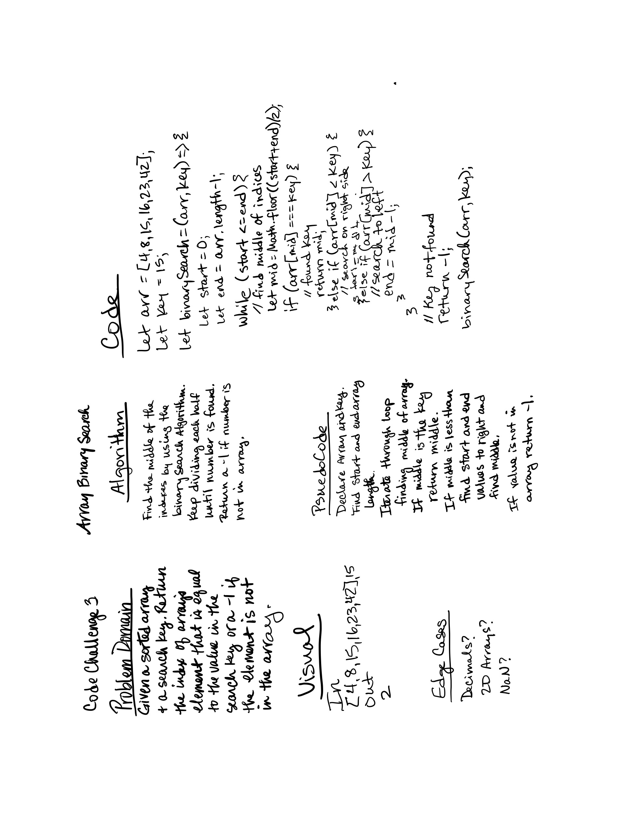

# Binary Search
Given a a sorted array and search key. Return the index of the array's element that is equal to the value in the search key or a -1 if the element is not in the array.

## Whiteboard Process

## Approach & Efficiency
Used the Binary Search Algorithm to find the middle index each time. If the middle is not the number, the algorithm moves to the right or left and uses the new start and end values to find the new middle value. It iterates through this until it find the value. If the value is not in array it returns -1.

